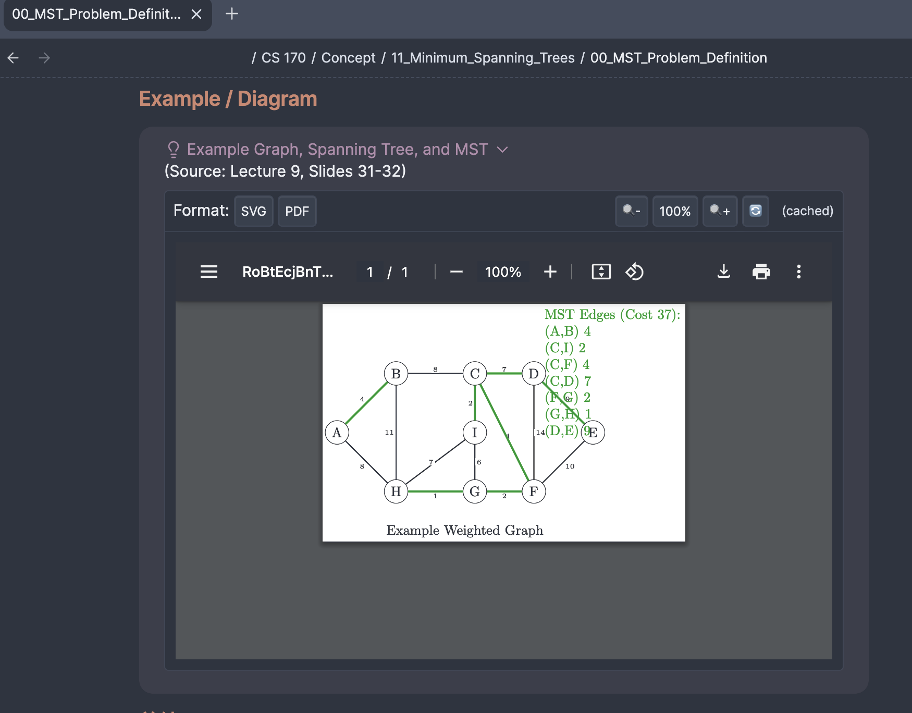

# TikZ Advanced Plugin for Obsidian

A professional-grade TikZ integration for Obsidian, enabling seamless creation of publication-quality diagrams, mathematical visualizations, and complex graphical representations directly in your knowledge base.

<!-- limit size of this image -->
<!-- another image on the right side for docs/images/tikz-advanced-demo2.png -->

<div style="display: flex; justify-content: space-between; align-items: center;">
  
  
  
</div>

[](https://github.com/perryzjc/obsidian-tikz-advanced/releases/latest)
[](https://github.com/perryzjc/obsidian-tikz-advanced/blob/main/LICENSE)
[](https://github.com/perryzjc/obsidian-tikz-advanced/issues)

## Why TikZ Advanced?

Transform your Obsidian vault into a comprehensive knowledge management system with precise, vector-based diagrams that enhance understanding and retention. The plugin's client-server architecture delivers robust rendering capabilities while maintaining clean, OCR-friendly, and LLM-compatible documentation.

## Features

- **Render TikZ diagrams** directly in your Obsidian notes
- **Client-server architecture** for robust rendering
- **Multiple LaTeX engines** support:
  - pdfLaTeX (fastest, good for most diagrams)
  - LuaLaTeX (better for complex diagrams)
  - XeLaTeX (good for custom fonts)
- **Multiple output formats**:
  - SVG (vector graphics, best for web)
  - PDF (high quality, good for printing)
- **Interactive features**:
  - Zoom in/out functionality
  - Format switching
  - One-click refresh
- **Performance optimizations**:
  - Intelligent caching system
  - Optimized SVG output
- **Smart library detection**:
  - Automatically detects required TikZ libraries
  - Supports inline library declarations
  - Provides helpful suggestions for missing libraries
- **Error handling**:
  - User-friendly error display
  - Detailed error messages
  - Helpful debugging information
- **Comprehensive library support**:
  - TikZ core libraries
  - PGFPlots for data visualization
  - Bayesian networks
  - Circuit diagrams
  - And many more specialized libraries

## Use Cases

### Knowledge Management & Academic Research
- **Mathematical Notation**: Create precise mathematical diagrams with perfect rendering of equations and symbols
- **Research Documentation**: Produce publication-quality figures directly in your research notes
- **Concept Visualization**: Illustrate complex concepts with clear, vector-based diagrams

### Data Science & Machine Learning
- **Statistical Models**: Visualize probability distributions and statistical concepts
- **Bayesian Networks**: Create detailed Bayesian network diagrams with proper notation
- **Neural Networks**: Design accurate neural network architecture diagrams
- **Decision Trees**: Illustrate decision processes and algorithmic flows

### System Architecture & Engineering
- **System Diagrams**: Document software and hardware architectures with professional diagrams
- **Circuit Designs**: Create precise electronic circuit schematics
- **Process Flows**: Illustrate complex processes and workflows

### OCR & LLM Compatibility
- **Vector-Based Rendering**: Produces clean SVG output that remains sharp at any scale
- **Semantic Structure**: Diagrams maintain their semantic meaning for better OCR recognition
- **Text-Based Source**: TikZ code is fully text-based, making it ideal for LLM processing and generation
- **Version Control Friendly**: Track changes to diagrams in version control systems

## Quick Start

For a quick introduction to installing and using the plugin, see the [Quick Start Guide](docs/QUICK_START.md).

## Installation

### Prerequisites

- **Obsidian** v0.15.0 or later
- For the server:
  - **Node.js** v14 or later
  - **LaTeX distribution** with at least one of:
    - pdfLaTeX
    - LuaLaTeX
    - XeLaTeX
  - **PDF to SVG converter** (at least one of):
    - pdf2svg (recommended)
    - Inkscape
    - pdftocairo

### Plugin Installation

1. Download the latest release from the [GitHub repository](https://github.com/perryzjc/obsidian-tikz-advanced/releases)
2. Extract the following files to your Obsidian vault's plugins directory:
   ```
   main.js
   manifest.json
   styles.css
   ```
   The plugins directory is located at: `<vault>/.obsidian/plugins/obsidian-tikz-advanced/`
3. Enable the plugin in Obsidian settings under "Community plugins"

### Server Installation

The TikZ server is required for rendering TikZ diagrams. You need to run it manually before using the plugin.

For detailed server setup instructions, see the [Server Setup Guide](docs/SERVER_SETUP.md).

Quick start:

1. Navigate to the `src/server` directory
2. Install dependencies: `npm install`
3. Start the server: `npm start`

The server will run on port 3000 by default.

## Usage

### Creating TikZ Diagrams

1. In your Obsidian note, create a code block with the `tikz` language identifier:

   ````markdown
   ```tikz
   \begin{tikzpicture}
     \draw (0,0) circle (1cm);
   \end{tikzpicture}
   ```
   ````

2. The diagram will be automatically rendered below the code block
3. Use the toolbar above the rendered diagram to:
   - Switch between SVG and PDF formats
   - Zoom in and out
   - Refresh the diagram

### Using TikZ Libraries

You can include TikZ libraries directly in your code:

````markdown
```tikz
\usetikzlibrary{bayesnet,positioning}
\begin{tikzpicture}
  \node[latent] (A) {A};
  \node[obs, right=of A] (B) {B};
  \edge {A} {B};
\end{tikzpicture}
```
````

The plugin will:
1. Automatically extract the library declarations
2. Add them to the preamble
3. Render the diagram with the required libraries

Additionally, the plugin automatically detects required libraries based on your code, even if you don't explicitly declare them.

### Example Diagrams

#### Basic Circle

<div style="display: flex; align-items: center; margin-bottom: 20px;">
<div style="flex: 1;">

```tikz
\begin{tikzpicture}
  \draw (0,0) circle (1cm);
\end{tikzpicture}
```

</div>
<div style="flex: 1;">

</div>
</div>

#### Bayesian Network

<div style="display: flex; align-items: center; margin-bottom: 20px;">
<div style="flex: 1;">

```tikz
\usetikzlibrary{bayesnet,positioning}
\begin{tikzpicture}
  % Define nodes
  \node[latent] (rain) at (0,0) {Rain};
  \node[latent, right=of rain] (sprinkler) {Sprinkler};
  \node[obs, below=of rain] (wet_roof) {Wet Roof};
  \node[obs, below=of sprinkler] (wet_grass) {Wet Grass};

  % Define edges
  \edge {rain} {sprinkler};
  \edge {rain} {wet_roof};
  \edge {rain} {wet_grass};
  \edge {sprinkler} {wet_grass};
\end{tikzpicture}
```

</div>
<div style="flex: 1;">

</div>
</div>

#### System Architecture

<div style="display: flex; align-items: center; margin-bottom: 20px;">
<div style="flex: 1;">

```tikz
\usetikzlibrary{arrows.meta,shapes.geometric,positioning}
\begin{tikzpicture}[
  server/.style={rectangle, rounded corners, draw, fill=blue!20, minimum width=2cm},
  database/.style={cylinder, draw, shape border rotate=90, aspect=0.3, fill=green!20},
  arrow/.style={-Stealth, thick}
]
  \node[server] (server) at (0,0) {Server};
  \node[database, right=of server] (db) {Database};

  \draw[arrow] (server) -- (db);
\end{tikzpicture}
```

</div>
<div style="flex: 1;">

</div>
</div>

#### Function Plot

<div style="display: flex; align-items: center; margin-bottom: 20px;">
<div style="flex: 1;">

```tikz
\begin{tikzpicture}
\begin{axis}[
    title={Simple Function},
    xlabel={$x$},
    ylabel={$y$},
    xmin=-2, xmax=2,
    ymin=-4, ymax=4,
    legend pos=north west,
    grid=both
]
\addplot[blue, domain=-2:2, samples=100] {x^2};
\addplot[red, domain=-2:2, samples=100] {x^3};
\legend{$x^2$, $x^3$}
\end{axis}
\end{tikzpicture}
```

</div>
<div style="flex: 1;">

</div>
</div>

#### Neural Network

<div style="display: flex; align-items: center; margin-bottom: 20px;">
<div style="flex: 1;">

```tikz
\usetikzlibrary{arrows.meta,positioning}
\begin{tikzpicture}[
  neuron/.style={circle, draw, minimum size=0.5cm},
  input/.style={neuron, fill=green!20},
  hidden/.style={neuron, fill=blue!20},
  output/.style={neuron, fill=red!20},
  arrow/.style={-Stealth, thick}
]
  % Input layer
  \node[input] (i1) at (0,0) {};
  \node[input] (i2) at (0,-1) {};
  \node[input] (i3) at (0,-2) {};

  % Hidden layer
  \node[hidden] (h1) at (2,0) {};
  \node[hidden] (h2) at (2,-1) {};

  % Output layer
  \node[output] (o1) at (4,-0.5) {};

  % Connections
  \foreach \i in {1,2,3}
    \foreach \j in {1,2}
      \draw[arrow] (i\i) -- (h\j);

  \foreach \i in {1,2}
    \draw[arrow] (h\i) -- (o1);
\end{tikzpicture}
```

</div>
<div style="flex: 1;">

</div>
</div>

See the [examples directory](examples/categories/) for more example diagrams organized by category.

## Configuration

You can configure the plugin in the Obsidian settings under "TikZ Advanced":

### Server Settings

- **TikZ Server URL**: URL of the TikZ rendering server (default: `http://localhost:3000`)
- **Preferred LaTeX Engine**: Choose between:
  - **pdfLaTeX**: Fastest, good for most diagrams
  - **LuaLaTeX**: Better for complex diagrams
  - **XeLaTeX**: Good for custom fonts

### Rendering Settings

- **Default Output Format**: Choose between SVG and PDF
- **Enable Zoom**: Toggle zoom functionality
- **Auto Refresh**: Automatically refresh diagrams when code changes

### Cache Settings

- **Enable Cache**: Cache rendered TikZ diagrams to improve performance
- **Cache TTL (minutes)**: Time to live for cached diagrams
- **Show Cache Indicator**: Show an indicator when a diagram is loaded from cache

### Advanced Settings

- **Custom Preamble**: Add custom LaTeX preamble for advanced use cases
  ```latex
  % Only needed for specialized packages not auto-detected
  \usepackage{tikz-cd}
  \usepackage{chemfig}
  ```
  Note: You can now include libraries directly in your TikZ code using `\usetikzlibrary{...}` instead of adding them to the custom preamble.

- **Debug Mode**: Enable debug mode for troubleshooting

## Development

### Project Structure

```
obsidian-tikz-advanced/
├── src/                  # Source code
│   ├── client/           # Client-side code (Obsidian plugin)
│   ├── server/           # Server-side code (TikZ rendering server)
│   └── shared/           # Shared code and types
├── docs/                 # Documentation
│   ├── images/           # Documentation images
│   └── *.md              # Documentation files
├── examples/             # Example TikZ diagrams
│   └── categories/       # Categorized examples
│       ├── basic/        # Basic shapes and commands
│       ├── bayesian/     # Bayesian network diagrams
│       ├── architecture/ # System architecture diagrams
│       ├── plots/        # Function plots and data visualization
│       └── advanced/     # Advanced examples with custom styles
├── dist/                 # Compiled output
│   ├── main.js           # Compiled plugin
│   ├── manifest.json     # Plugin manifest
│   └── styles.css        # Plugin styles
├── tikz-tools.sh         # Build and utility script
└── README.md             # Project readme
```

### Building the Plugin

1. Clone the repository:
   ```bash
   git clone https://github.com/perryzjc/obsidian-tikz-advanced.git
   cd obsidian-tikz-advanced
   ```

2. Install dependencies:
   ```bash
   npm install
   ```

3. Build the plugin using the provided script:
   ```bash
   ./tikz-tools.sh build
   ```

   This will create the following files in the `dist` directory:
   - `main.js`: The compiled plugin
   - `manifest.json`: The plugin manifest
   - `styles.css`: The plugin styles

### Development Workflow

For development with hot reloading:

```bash
./tikz-tools.sh dev
```

### Running the Server

Start the TikZ rendering server:

```bash
./tikz-tools.sh server
```

### Testing

Test the plugin with example diagrams:

```bash
./tikz-tools.sh test
```

### Documentation

- [Quick Start Guide](docs/QUICK_START.md): Get up and running quickly
- [User Guide](docs/USER_GUIDE.md): Comprehensive guide for users
- [TikZ Code Format](docs/TIKZ_CODE_FORMAT.md): Guide for writing TikZ code in Obsidian
- [Server Setup Guide](docs/SERVER_SETUP.md): Detailed server setup instructions
- [Developer Guide](docs/DEVELOPER_GUIDE.md): Guide for developers
- [API Documentation](docs/API.md): API documentation
- [Changelog](CHANGELOG.md): Version history and changes

## Contributing

Contributions are welcome! Please feel free to submit a Pull Request.

1. Fork the repository
2. Create your feature branch (`git checkout -b feature/amazing-feature`)
3. Commit your changes (`git commit -m 'Add some amazing feature'`)
4. Push to the branch (`git push origin feature/amazing-feature`)
5. Open a Pull Request

### Bug Reports and Feature Requests

If you find a bug or have a feature request, please open an issue on the [GitHub repository](https://github.com/perryzjc/obsidian-tikz-advanced/issues).

## License

This project is licensed under the MIT License - see the [LICENSE](LICENSE) file for details.

## Elevate Your Knowledge Base

TikZ Advanced transforms Obsidian from a note-taking app into a comprehensive knowledge management system capable of representing complex concepts with precision and clarity. Whether you're documenting research, creating educational content, or building a personal knowledge base, this plugin provides the tools to express ideas visually with publication-quality diagrams.

The vector-based output ensures your diagrams remain crisp and clear at any scale, making them perfect for:
- Digital knowledge bases
- OCR processing
- LLM training and analysis
- Academic publications
- Technical documentation

Join the growing community of knowledge workers who use TikZ Advanced to enhance understanding, improve retention, and communicate complex ideas effectively.

## Acknowledgements

- [Obsidian](https://obsidian.md/) for the amazing knowledge base app
- [TikZ](https://tikz.dev/) for the powerful drawing package
- [PGFPlots](http://pgfplots.sourceforge.net/) for the plotting capabilities
- [pdf2svg](https://github.com/dawbarton/pdf2svg) for PDF to SVG conversion
- All contributors who have helped improve this plugin
