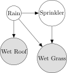
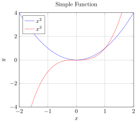

# TikZ Advanced Plugin Quick Start Guide

This guide will help you get up and running with the TikZ Advanced plugin for Obsidian as quickly as possible.

## Installation

### 1. Install the Plugin

1. Download the latest release files from the [GitHub repository](https://github.com/perryzjc/obsidian-tikz-advanced/releases)
2. Extract the following files to your Obsidian vault's plugins directory:
   - `main.js`
   - `manifest.json`
   - `styles.css`
3. The plugins directory is located at: `<vault>/.obsidian/plugins/obsidian-tikz-advanced/`
4. Enable the plugin in Obsidian settings under "Community plugins"

### 2. Set Up the Server

The TikZ server is required for rendering diagrams:

1. Ensure you have [Node.js](https://nodejs.org/) (v14+) and a [LaTeX distribution](https://www.latex-project.org/get/) installed
2. Navigate to the `src/server` directory
3. Install dependencies: `npm install`
4. Start the server: `npm start`
5. The server will run on port 3000 by default

## Creating Your First Diagram

1. In Obsidian, create a new note or open an existing one
2. Add a code block with the `tikz` language identifier:

````markdown
```tikz
\begin{tikzpicture}
  \draw (0,0) circle (1cm);
\end{tikzpicture}
```
````

3. The diagram will be automatically rendered below the code block
4. Use the toolbar above the diagram to:
   - Switch between SVG and PDF formats
   - Zoom in and out
   - Refresh the diagram

## Example Diagrams

Below are examples of TikZ diagrams you can create with this plugin. Each example shows the TikZ code on the left and the rendered diagram on the right.

<div style="display: flex; flex-wrap: wrap; gap: 20px; margin-bottom: 30px;">

<div style="flex: 1; min-width: 300px;">

### Basic Shapes

```tikz
\begin{tikzpicture}
  \draw (0,0) circle (1cm);
  \draw (3,0) rectangle (5,2);
  \draw (7,0) -- (8,2) -- (9,0) -- cycle;
\end{tikzpicture}
```

</div>
<div style="flex: 1; min-width: 300px; display: flex; align-items: center; justify-content: center;">
  
</div>
</div>

<div style="display: flex; flex-wrap: wrap; gap: 20px; margin-bottom: 30px;">
<div style="flex: 1; min-width: 300px;">

### Styled Elements

```tikz
\begin{tikzpicture}
  \draw[thick, red] (0,0) circle (1cm);
  \draw[fill=blue, opacity=0.5] (3,0) rectangle (5,2);
  \draw[thick, green, dashed] (7,0) -- (8,2) -- (9,0) -- cycle;
\end{tikzpicture}
```

</div>
<div style="flex: 1; min-width: 300px; display: flex; align-items: center; justify-content: center;">
  
</div>
</div>

<div style="display: flex; flex-wrap: wrap; gap: 20px; margin-bottom: 30px;">
<div style="flex: 1; min-width: 300px;">

### Bayesian Network

```tikz
\usetikzlibrary{bayesnet,positioning}
\begin{tikzpicture}
  % Define nodes
  \node[latent] (rain) {Rain};
  \node[latent, right=of rain] (sprinkler) {Sprinkler};
  \node[obs, below=of rain] (wet_roof) {Wet Roof};
  \node[obs, below=of sprinkler] (wet_grass) {Wet Grass};

  % Define edges
  \edge {rain} {sprinkler};
  \edge {rain} {wet_roof};
  \edge {rain} {wet_grass};
  \edge {sprinkler} {wet_grass};
\end{tikzpicture}
```

</div>
<div style="flex: 1; min-width: 300px; display: flex; align-items: center; justify-content: center;">
  
</div>
</div>

<div style="display: flex; flex-wrap: wrap; gap: 20px; margin-bottom: 30px;">
<div style="flex: 1; min-width: 300px;">

### Function Plot

```tikz
\begin{tikzpicture}
\begin{axis}[
    title={Simple Function},
    xlabel={$x$},
    ylabel={$y$},
    xmin=-2, xmax=2,
    ymin=-4, ymax=4,
    grid=both
]
\addplot[blue, domain=-2:2, samples=100] {x^2};
\addplot[red, domain=-2:2, samples=100] {x^3};
\legend{$x^2$, $x^3$}
\end{axis}
\end{tikzpicture}
```

</div>
<div style="flex: 1; min-width: 300px; display: flex; align-items: center; justify-content: center;">
  
</div>
</div>

## Basic Configuration

### Custom Preamble

Add custom LaTeX packages and commands in the plugin settings:

```latex
\usepackage{tikz}
\usepackage{pgfplots}
\pgfplotsset{compat=1.18}
\usetikzlibrary{arrows.meta,shapes,positioning,calc}
```

### Server URL

If you're running the server on a different machine or port, update the server URL in the plugin settings.

## Troubleshooting

If your diagram doesn't render:

1. Check that the server is running
2. Verify your TikZ code syntax
3. Look for error messages in the diagram display
4. Check the server console for detailed error logs

## Next Steps

- Read the full [User Guide](USER_GUIDE.md) for detailed information
- Explore the [Server Setup Guide](SERVER_SETUP.md) for advanced server configuration
- Check out the [TikZ documentation](https://tikz.dev/) for more diagram examples
