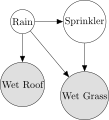
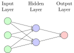

# TikZ Examples Collection

This directory contains a collection of verified TikZ examples that work with the TikZ Advanced plugin for Obsidian.

## Categories

The examples are organized into the following categories:

### Basic Shapes
**[Basic Examples](categories/basic/)**: Simple shapes, lines, and basic TikZ commands


### Bayesian Networks
**[Bayesian Network Examples](categories/bayesian/)**: Examples of Bayesian networks using the tikz-bayesnet library



### System Architecture
**[System Architecture Examples](categories/architecture/)**: System architecture diagrams


### Plots and Charts
**[Plot Examples](categories/plots/)**: Function plots and data visualization using PGFPlots


### Advanced Diagrams
**[Advanced Examples](categories/advanced/)**: Advanced examples with custom styles and complex diagrams



## Using These Examples

### Quick Start

1. Install the TikZ Advanced plugin in Obsidian
2. Start the TikZ rendering server (see [Server Setup Guide](../docs/SERVER_SETUP.md))
3. Browse the categories above and find an example you like
4. Copy the TikZ code from the example
5. Paste it into a code block with the `tikz` language identifier in your Obsidian note:

   ````markdown
   ```tikz
   \begin{tikzpicture}
     \draw (0,0) circle (1cm);
   \end{tikzpicture}
   ```
   ````

6. The diagram will be automatically rendered

### Tips for Using Examples

- **Customize the examples**: Feel free to modify the examples to suit your needs
- **Combine elements**: You can combine elements from different examples
- **Learn from the code**: Study the examples to learn TikZ syntax and techniques
- **Use the library declarations**: Pay attention to the `\usetikzlibrary{...}` declarations at the beginning of examples
- **Check the documentation**: Refer to the [TikZ Code Format Guide](../docs/TIKZ_CODE_FORMAT.md) for more information

## Testing Examples

All examples in this directory have been verified to work with the TikZ Advanced plugin. If you encounter any issues, please report them on the [GitHub repository](https://github.com/perryzjc/obsidian-tikz-advanced/issues).

## Contributing Examples

If you'd like to contribute additional examples:

1. Create a new Markdown file in the appropriate category directory
2. Include a clear title and description
3. Add your TikZ code in a code block with the `tikz` language identifier
4. Test your example to ensure it renders correctly
5. Submit a pull request
