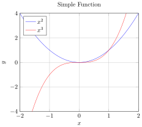

# Plot Examples

This directory contains examples of function plots and data visualization using PGFPlots. These examples demonstrate how to create professional-looking plots and charts for scientific and mathematical content.

## Examples

### [Function Plots](function_plots.md)
Examples of function plots, bar charts, and 3D surfaces using PGFPlots



## Key Concepts

- **Axis Environment**: The `axis` environment is used to create plots
- **Plot Types**: Different types of plots (2D functions, bar charts, 3D surfaces)
- **Styling**: Customizing colors, line styles, markers, and grid
- **Labels**: Adding titles, axis labels, and legends
- **Data Sources**: Plotting functions or data from external files

## Getting Started

To create plots with PGFPlots, include the package and use the axis environment:

```tikz
\usepackage{pgfplots}
\pgfplotsset{compat=1.18}
\begin{tikzpicture}
\begin{axis}[
    title={Simple Function},
    xlabel={$x$},
    ylabel={$y$},
    xmin=-2, xmax=2,
    ymin=-4, ymax=4,
    legend pos=north west,
    grid=both
]
\addplot[blue, domain=-2:2, samples=100] {x^2};
\addplot[red, domain=-2:2, samples=100] {x^3};
\legend{$x^2$, $x^3$}
\end{axis}
\end{tikzpicture}
```
